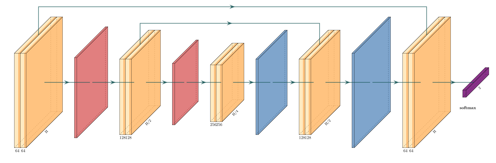

<p align="center">
  <picture>
    <source media="(prefers-color-scheme: dark)" srcset="docs/_static/wordmark-dark.png">
    
  </picture>
</p>

<p align="center">
  Draw neural network architecture diagrams with LaTeX and TikZ,
  from Python or the command line.
</p>

<p align="center">
  <a href="https://github.com/siddharth7113/synaplot/actions/workflows/ci.yml">
    </a>
  <a href="https://github.com/siddharth7113/synaplot/blob/main/LICENSE">
    </a>
  
  <a href="https://github.com/astral-sh/ruff">
    </a>
</p>

<p align="center">
  
</p>

Describe a network as a list of layers and the connections between them.
synaplot turns that into TikZ code and renders it to SVG, PNG, PDF, or LaTeX
source, from Python or from the command line.

> **Early development.** The API will change, and synaplot is not on PyPI yet.

## Quickstart

```python
import synaplot as sp

diagram = sp.Diagram(name="lenet")
diagram.add(
    sp.Conv(name="conv1", filters=64, spatial=512, caption="conv1"),
    sp.Pool(name="pool1"),
    sp.ConvRelu(name="conv2", filters=[128, 128, 128], spatial=256),
    sp.Softmax(name="out", classes=10, caption="softmax"),
)
diagram.connect("conv1", "pool1")
diagram.connect("pool1", "conv2")
diagram.connect("conv2", "out")
diagram.connect("conv1", "out", style="skip")

diagram.save("lenet.svg")
```

Or from a file that builds a diagram:

```console
synaplot render examples/lenet.py -o lenet.svg
```

The format comes from the suffix: `.svg`, `.png`, `.pdf`, or `.tex`.

## Installing

synaplot is not on PyPI yet. Install it from a checkout:

```console
git clone https://github.com/siddharth7113/synaplot
pip install ./synaplot
```

Writing LaTeX source needs nothing else. A PDF or an image needs a LaTeX
engine, and an SVG or PNG needs a converter as well. To see what you have and
how to install the rest:

```console
synaplot doctor
```

[Tectonic](https://tectonic-typesetting.github.io/) is the shortest route. It
is one program, needs no TeX installation, and downloads the LaTeX packages a
document asks for.

## Putting a diagram in a paper

`to_tex` writes a document that carries its own style definitions, so it
compiles from any directory and pastes into Overleaf unchanged:

```python
print(diagram.to_tex())  # a document on its own
print(diagram.to_tex(standalone=False))  # a fragment for a paper you have
```

The style definitions use private macro names, so loading them does not
redefine `\caption`, `\fill`, or anything else in the document around them.

## Documentation

The documentation is at [synaplot.readthedocs.io](https://synaplot.readthedocs.io).

## Credits

synaplot is a rewrite of
[PlotNeuralNet](https://github.com/HarisIqbal88/PlotNeuralNet) by Haris Iqbal,
MIT licensed. The TikZ code that draws every box, banded box, and ball comes
from that project. It ships in
[src/synaplot/latex/styles/](src/synaplot/latex/styles/), and each file records
what changed.

Scripts written for PlotNeuralNet do not work with synaplot. The Python
interface, the rendering pipeline, and the command-line tool are new.

If you use synaplot in academic work, please cite both projects. See
[CITATION.cff](CITATION.cff); PlotNeuralNet's DOI is
[10.5281/zenodo.2526396](https://doi.org/10.5281/zenodo.2526396).

## License

MIT. See [LICENSE](LICENSE) and [NOTICE](NOTICE).
